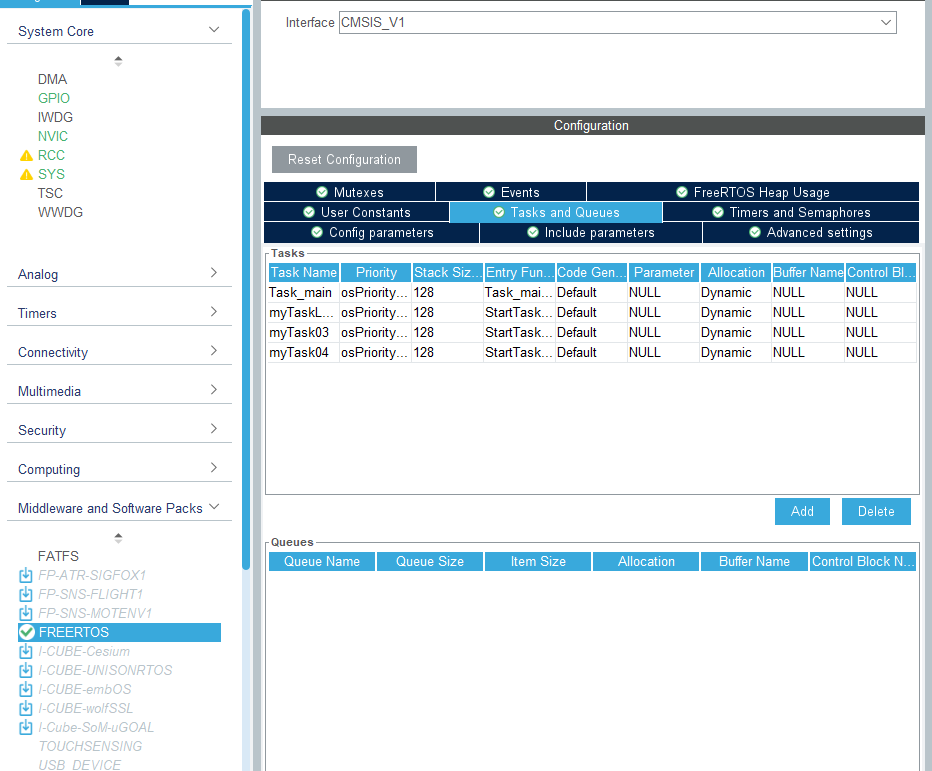
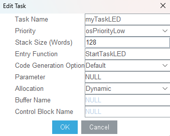
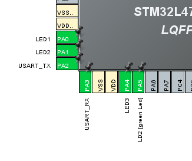
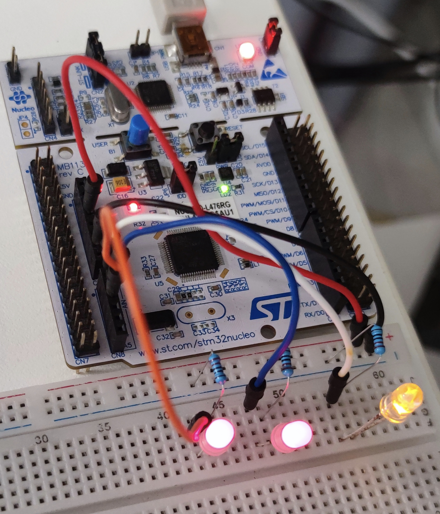
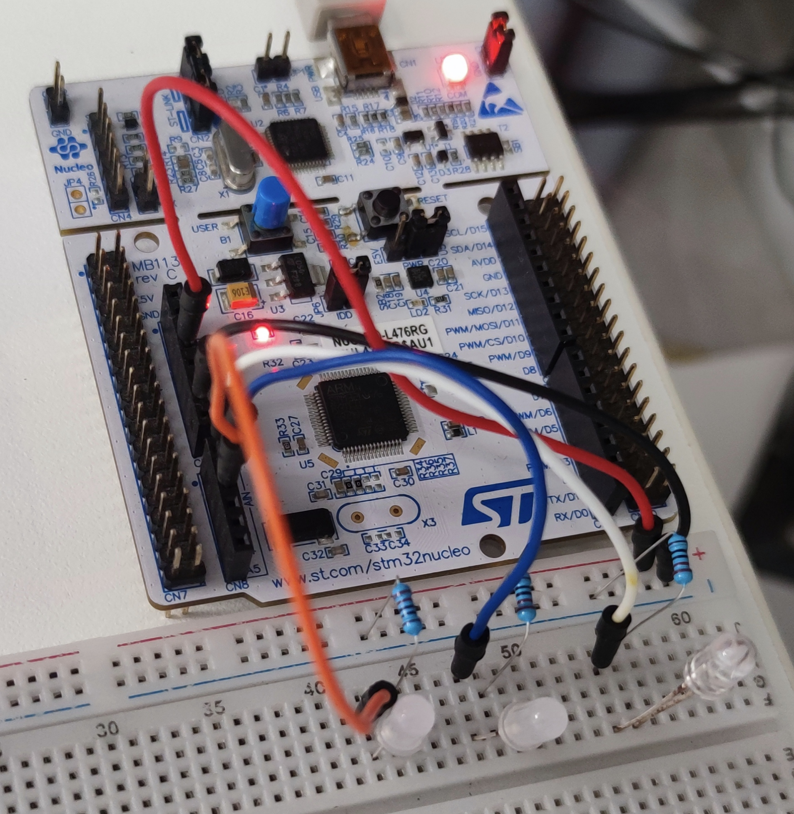
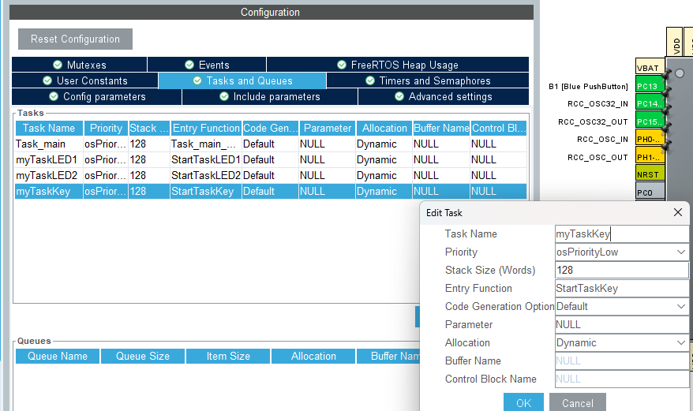
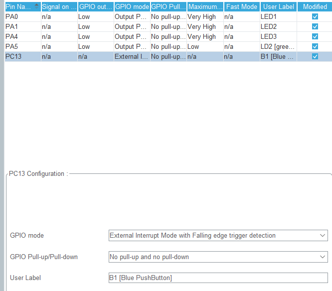
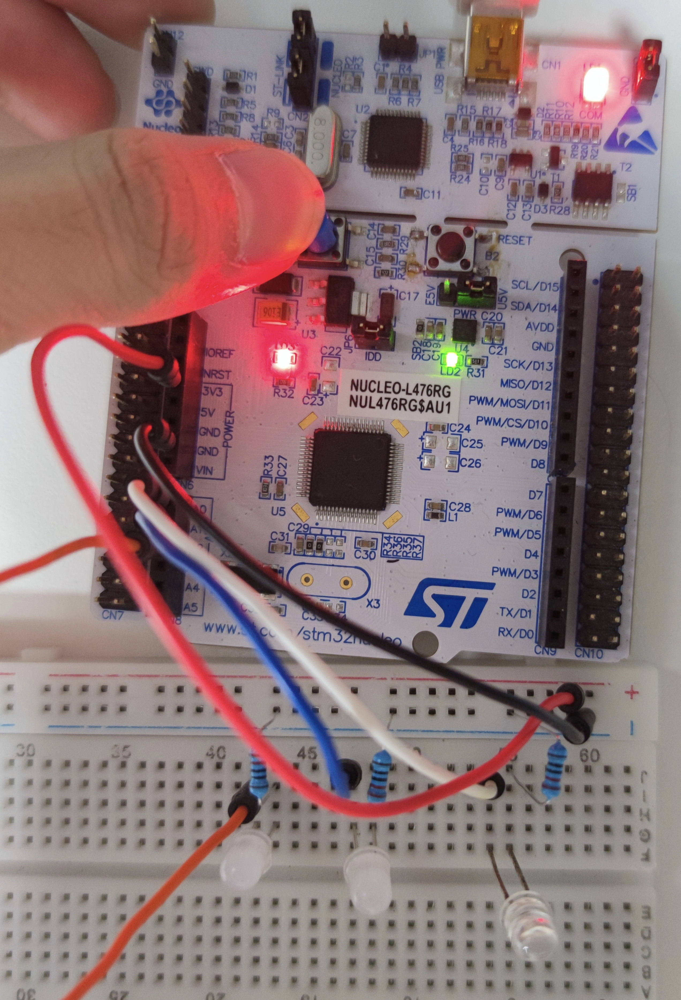
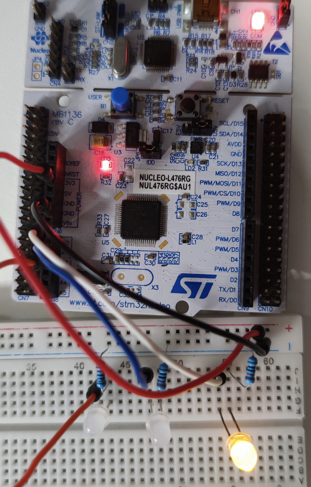

# 实现4个LED灯同步亮灭

### Cubemx生成代码部分

使用Cubemx生成代码,你需要这样设置freeRTOS就行



然后注意添加任务的优先级



添加三个任务后再定义用于驱动LED的GPIO口



然后生成代码就行

### Clion编辑代码部分

在生成的freertos.c文件中的第142行开始就是生成的任务函数写下LED灯闪烁的代码即可

```c
void Task_main_Start(void const * argument)
{
  /* USER CODE BEGIN Task_main_Start */
  /* Infinite loop */
  for(;;)
  {
      HAL_GPIO_TogglePin(LD2_GPIO_Port,LD2_Pin);
      osDelay(500);
  }
  /* USER CODE END Task_main_Start */
}

/* USER CODE BEGIN Header_StartTaskLED */
/**
* @brief Function implementing the myTaskLED thread.
* @param argument: Not used
* @retval None
*/
/* USER CODE END Header_StartTaskLED */
void StartTaskLED(void const * argument)
{
  /* USER CODE BEGIN StartTaskLED */
  /* Infinite loop */
  for(;;)
  {
      HAL_GPIO_TogglePin(LED1_GPIO_Port,LED1_Pin);
    osDelay(500);
  }
  /* USER CODE END StartTaskLED */
}

/* USER CODE BEGIN Header_StartTask03 */
/**
* @brief Function implementing the myTask03 thread.
* @param argument: Not used
* @retval None
*/
/* USER CODE END Header_StartTask03 */
void StartTask03(void const * argument)
{
  /* USER CODE BEGIN StartTask03 */
  /* Infinite loop */
  for(;;)
  {
      HAL_GPIO_TogglePin(LED2_GPIO_Port,LED2_Pin);
    osDelay(500);
  }
  /* USER CODE END StartTask03 */
}

/* USER CODE BEGIN Header_StartTask04 */
/**
* @brief Function implementing the myTask04 thread.
* @param argument: Not used
* @retval None
*/
/* USER CODE END Header_StartTask04 */
void StartTask04(void const * argument)
{
  /* USER CODE BEGIN StartTask04 */
  /* Infinite loop */
  for(;;)
  {
      HAL_GPIO_TogglePin(LED3_GPIO_Port,LED3_Pin);
    osDelay(500);
  }
  /* USER CODE END StartTask04 */
}
```

其他什么都不用,下载到开发板,看效果





结果是LED确实以500毫秒的事件闪烁起来


# 按键控制LED灯亮灭

```c
/**
* @brief  Set the specified Signal Flags of an active thread.
* @param  thread_id     thread ID obtained by \ref osThreadCreate or \ref osThreadGetId.
* @param  signals       specifies the signal flags of the thread that should be set.
* @retval previous signal flags of the specified thread or 0x80000000 in case of incorrect parameters.
* @note   MUST REMAIN UNCHANGED: \b osSignalSet shall be consistent in every CMSIS-RTOS.
*/
int32_t osSignalSet (osThreadId thread_id, int32_t signal)
```

这个函数用于发送通知,

第一个参数:osThreadId thread_id:被通知线程的句柄

第二个参数:int32_t signa:发送的信号


```c
/**
* @brief  Wait for one or more Signal Flags to become signaled for the current \b RUNNING thread.
* @param  signals   wait until all specified signal flags set or 0 for any single signal flag.
* @param  millisec  timeout value or 0 in case of no time-out.
* @retval  event flag information or error code.
* @note   MUST REMAIN UNCHANGED: \b osSignalWait shall be consistent in every CMSIS-RTOS.
*/
osEvent osSignalWait (int32_t signals, uint32_t millisec)
```

这个函数用于接收通知

第一个参数int32_t signals:用于控制将singnals中的那位置零

例如

```c
0x03=(二进制)0000 0011			//将会把第0位和第1位置零
```


第二个参数uint32_t millisec:设定阻塞时间(ms)

---

在CubeMX中添加一个任务




按键GPIO输入已经定义好




在Clion中编写代码

按键检测

```c
void StartTaskKey(void const * argument)
{
  /* USER CODE BEGIN StartTaskKey */
  /* Infinite loop */
  for(;;)
  {
      if(HAL_GPIO_ReadPin(B1_GPIO_Port,B1_Pin)==GPIO_PIN_RESET){
          osSignalSet(myTaskLED1Handle,0x01);
      }
      else{
          osSignalSet(myTaskLED1Handle,0x02);
      }
    osDelay(1);
  }
  /* USER CODE END StartTaskKey */
}
```


控制LED灯的亮灭

```c
void StartTaskLED1(void const * argument)
{
  /* USER CODE BEGIN StartTaskLED1 */
  osEvent event;

  /* Infinite loop */
  for(;;)
  {
    event= osSignalWait(0x03,10);

  if(event.status==osEventSignal){
      if(event.value.signals==0x01){
          HAL_GPIO_WritePin(LD2_GPIO_Port,LD2_Pin,GPIO_PIN_SET);
          HAL_GPIO_WritePin(LED1_GPIO_Port,LED1_Pin,GPIO_PIN_RESET);
      }

      if(event.value.signals==0x02){
          HAL_GPIO_WritePin(LED1_GPIO_Port,LED1_Pin,GPIO_PIN_SET);
          HAL_GPIO_WritePin(LD2_GPIO_Port,LD2_Pin,GPIO_PIN_RESET);
      }
  }
    osDelay(1);
  }
  /* USER CODE END StartTaskLED1 */
}
```


然后其他不用管,看效果





可见程序正常运行起来
